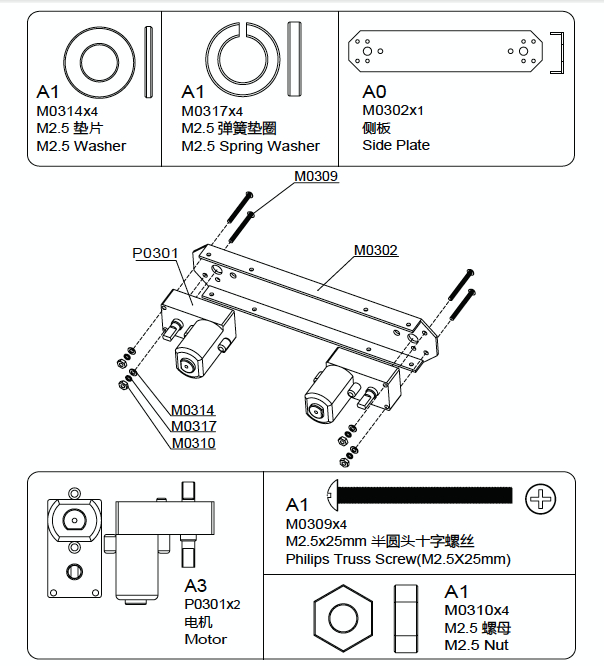
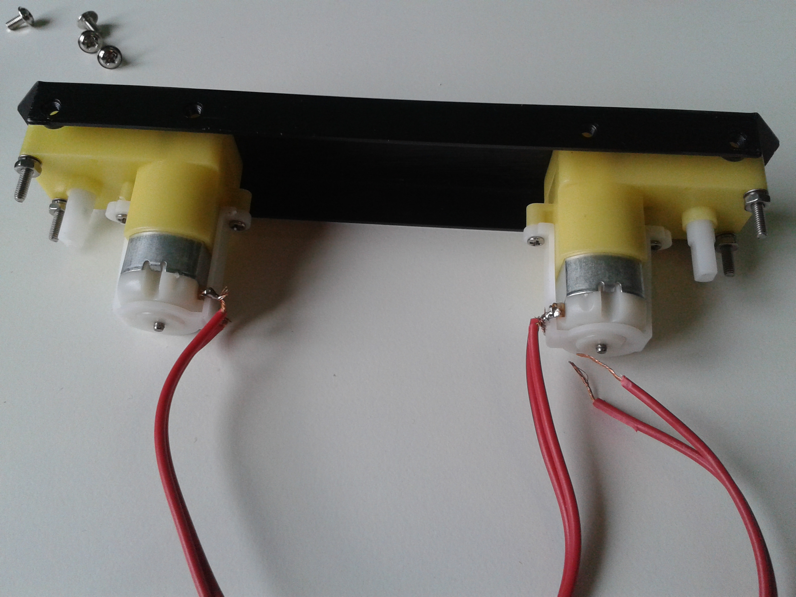
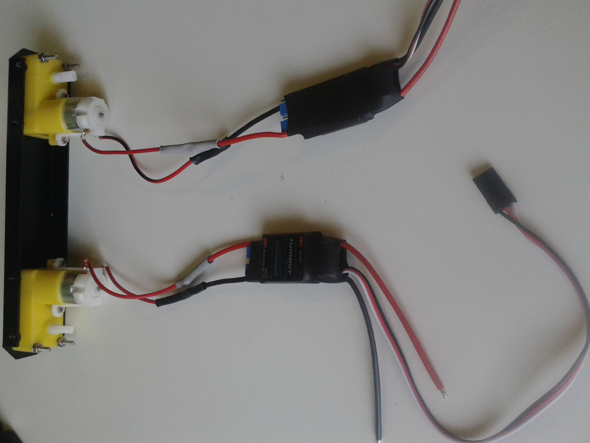
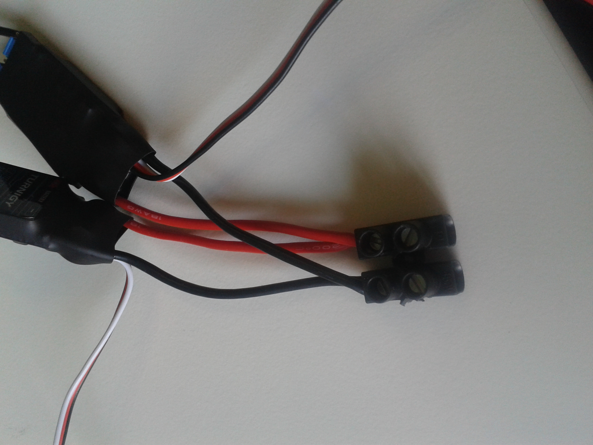
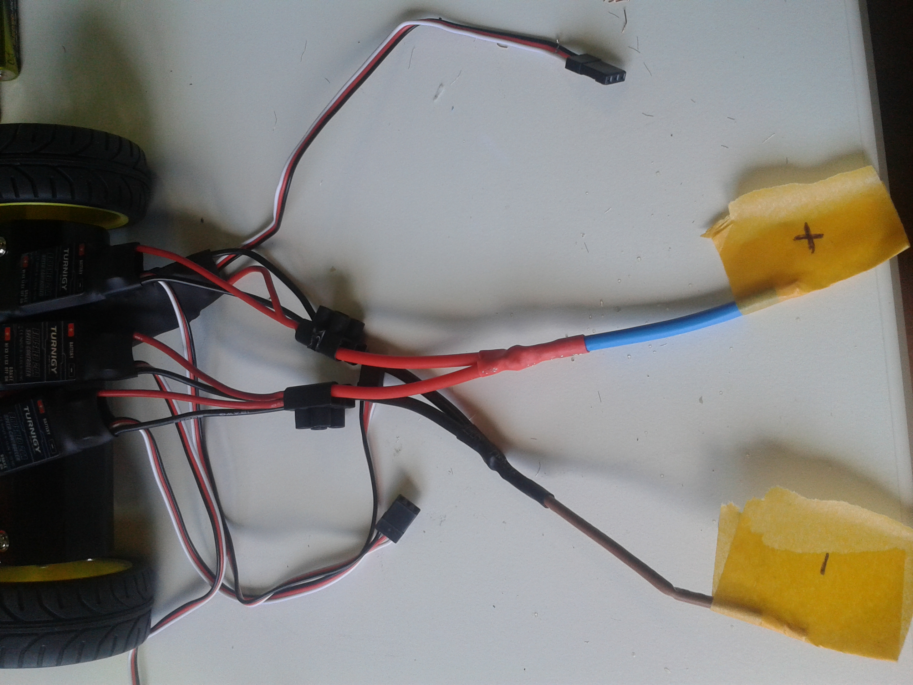

# Motors Assembly

You have to repeat this process twice: you should screw two motors to each side plate. Be careful with the **position of the motors** (looking to the inside part). Also, **note the order** when screwing: first the washer, second the spring washer and last the nut.

After having done this, take eigth pieces of wire and tie them to the metal-holes in the motors(two wire pieces for each motor). We have tied them in the following order: the black wire on the up hole and down the red wire.Then,for better fixation, **weld the wires** with a bit of tin.You can get support in [this video](https://www.youtube.com/watch?v=IU9lQ-wKoXo).

We are now going to **connect the ESC** (Electronic Speed control) to the motors, We have choose The *TURNIGY BRUSHED 20A ESC*. One of each wires attached to the motors should be welded to one of the ESC connectors: the red wire from the motor with the red one from the ESC and the black wire from the motor with the black one of the ESC; like in the image:

Then we need to **collect together** all the red wires on one side, and all the black wires on the other.They will be the wires connected to the battery.
You can gather them together, following the example in the images below:

First put together the rigth side wires and the left side wires, separetely.In the image you can see the wires from the left side:

Then, join the left and rigth side wires.You should get a **positive end (+)** formed from the red wires and a **negative end (-)** from the black wires:

