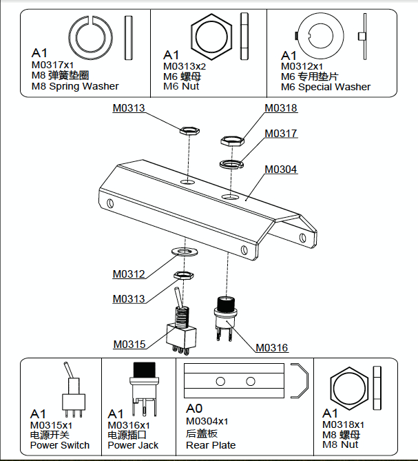

# Power Jack and Switch Assembly

The next step is the assembly of the power jack and the switch.
Be careful with the order of the nuts and washers.

After attaching power jack and switch to the rear plate, you have to weld the wires with tin to these two items.

- **Weld wires to the switch**:

One wire should be tied to the middle connector and another wire should be tied to the ON position connection, you have two options: the rigth or the left.

For example, my choice has been the left connector.This means that the switch will be ON, when the outside piece of the switch is on the rigth, like on th following photo:

- **Weld wires to the power jack**:

The power jack will be use when we don't feed the rover with the five cells. You can weld three wires to it. For now left the other side  of the wire unpeeled, in order to avoid electrical dead shorts when wires touch each other.
