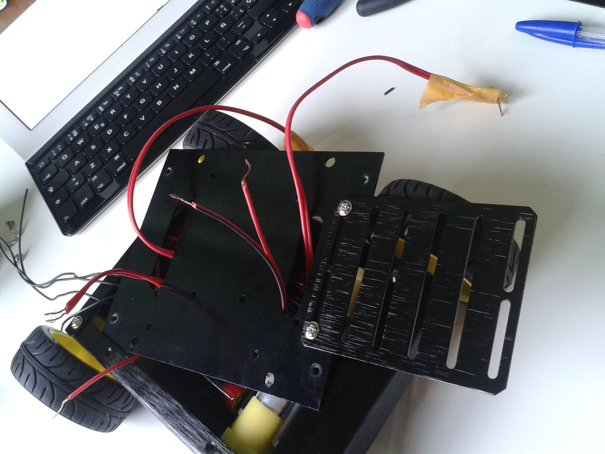

# Top Plate Assembly

After doing all the connections and connecting the cells, attach the upper Deck usig four screws as indicated in the figure above.
You should **get out**, through the slots, the wires:

- The left motors' wires.

- The rigth motors' wires.

*Note*: You can identify one side motors using scotch tape.

- The battery black-wire.

- The switch ON-wire.

This wires will be later connected to the board, so please be careful to take them all out.

