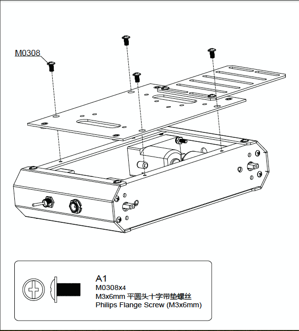

# Upper Deck Assembly

After doing all the connections, attach the upper Deck usig four screws as indicated in the figure above.
You should get out, through the slots, the wires:

- The left motors' wires.

- The rigth motors' wires.

*Note*: You can mark ine side motors using scotch tape).

- The battery black-wire.

- The switch ON-wire.

