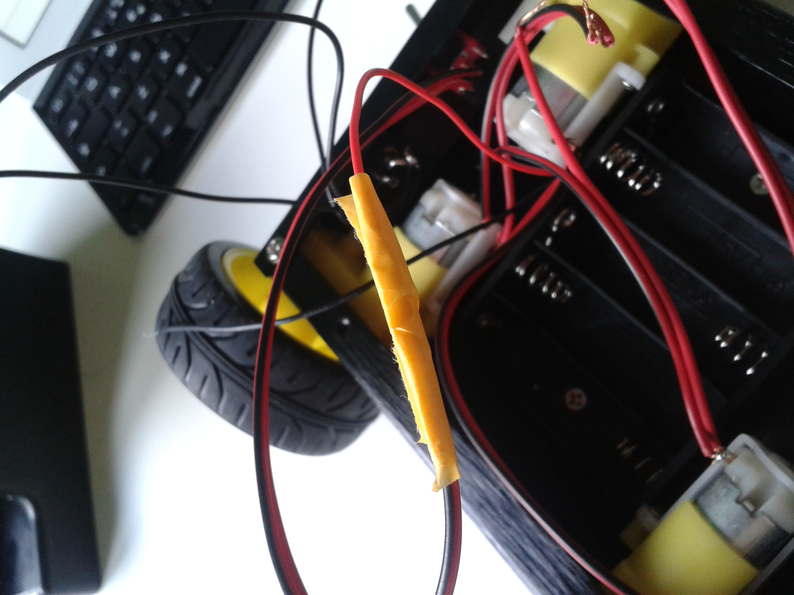

# Wire up

We are going to connect the ESC (Electronic Speed control) to the motors, We have choose The TURNIGY BRUSHED 20A ESC.

First of all you have to take the two wires, you havetied to the motors: the red-wire comming for the battery pack and the middle wire comming from the switch. You have to connect them, so **twist them together** and cover them with a tape layer.
Like this:

Now your power wires become the black-wire comming from the battery and the ON-wire comming from the switch.

Then, **identify** one side motors with scotch tape.

Finally **remember to connect the cells**.

