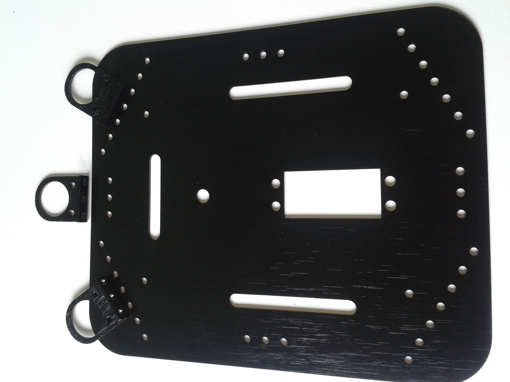

# IR Sensor Bracket Assembly (Optional)

This step is optional, as there is no need of this to the rover funcionality.

Be careful when choosing the holes where screwing the IR sensor mounting bracket.

