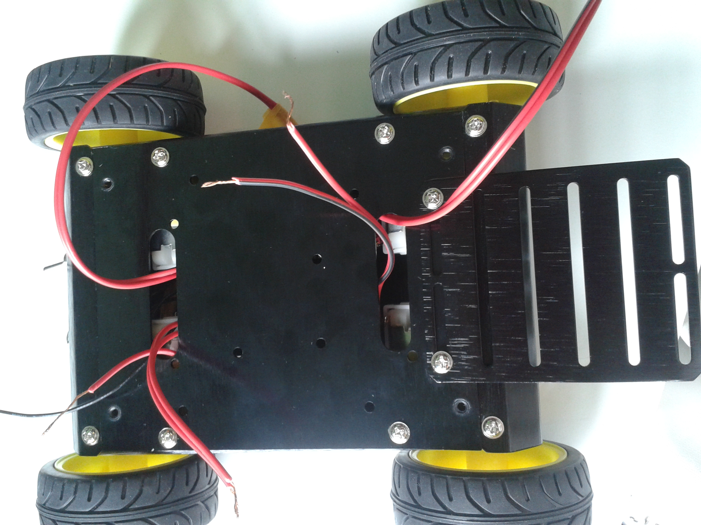

# Top Plate Assembly

After doing all the connections and connecting the cells, attach the upper Deck using four screws as indicated in the figure above.
You should **get out**, through the slots, the wires:

- The motors + ESC wires: Positive and Negative ends.

- The switch wires.

- The ESC connectors.

This wires will be later connected to the board, so please be careful to **take all the wires out**.Also remember to **identify which connector belongs to each motor**, you can for example number them.

Remember to mark the rigth and left side motors to differenciate them, before closing. For more info read *connecting with erle-board*.
