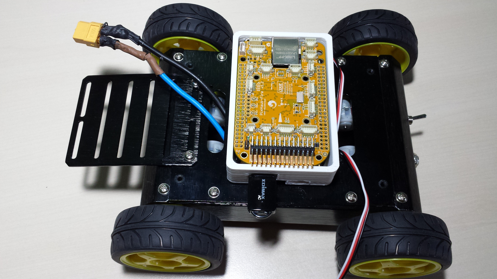

#Erle Gitbook Rover
---

# Erle Robotics Rover Gitbook

##Book

Este gitbook comenta la construcción y desarrollo del **Erle-Rover**.

**Erle-Rover** es una plataforma móvil terrestre, que implementa la *placa Erle* para su control. Utilizando la *tecnología de Erle* se abre un rango de posibilidades como el control del rover mediante un tableta o un smartphone, o incluso programarlo para que siga una ruta deseada.

##Info

Durante años, hemos estado trabajando en el campo de la robótica, particularmente con drones. Hemos estado en diferentes Universidades y centros de investigación, y en todos estos sitios hemos encontrado que la mayoría de los **drones son cajas negras** (mira nuestro [60s pitch](https://www.youtube.com/watch?v=tKAqjyXaC18)). No con la intención de usarlos para el aprendizaje, investigación. El software que usan la mayoría de las veces es desconocido, de código cerrado o **no documentado**. Dadas estas condiciones, cómo vamos a educar a las siguientes generaciones es éstas tecnologías? Como empezar a programar drones si no tienes +1000$? Que plataforma me permite empezar con los drones sin arriesgarme la mano?

Estamos llegando con una respuesta a todas estas preguntas, nuestra tecnología: **Erle**.

Inspirado en la BeagleBoard, hemos diseñado un pequeño computador con más de 36 sensores, un montón de I/O y potencia de procesamiento para el análisis en tiempo real. Erle es la tecnología habilitadora para la próxima generación de robots aéreos y terrestres que se utilizará en las ciudades de resolución de tareas como la vigilancia, el monitoreo ambiental o incluso la prestación de ayuda en catástrofes.

Nuestro ordenador Linux de pequeñas dimensiones está acercando la robótica a la gente y los negocios.

##Licencia

A menos que se especifique lo contrario, éste contenido está bajo Creative Commons Attribution-NonComercial-Share Alike 3.0 Unported License Para ver una copia de la licencia visita http://creativecommons.org/licenses/by-sa/3.0/](http://creativecommons.org/licenses/by-sa/3.0/) o envía una carta a Creative Commons, 171 Second Street, Suite 300, San Francisco, California, 94105, USA.

Todos los trabajos derivados deben de ser atribuidos a Erle Robotics S.L.. Para ver la lista de autores revisa **Erle Robotics S.L.**.

Para cualquier pregunta, preocupación o problema contáctenos en support [en] erlerobot.com.
