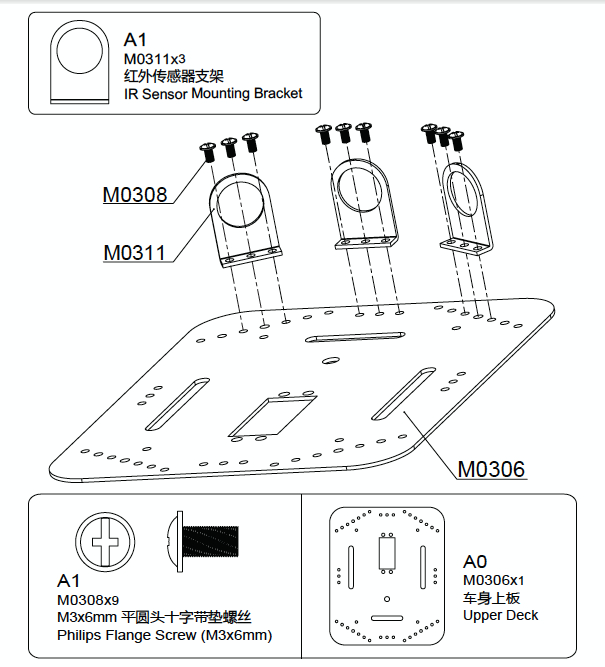

# Montaje del sensor IR Sensor (Opcional)

Este es un paso opcional, ya que no hay necesidad de esto a la funcionalidad del rover.

Tenga cuidado con elegir los agujeros donde atornillar el soporte de montaje del sensor IR.

