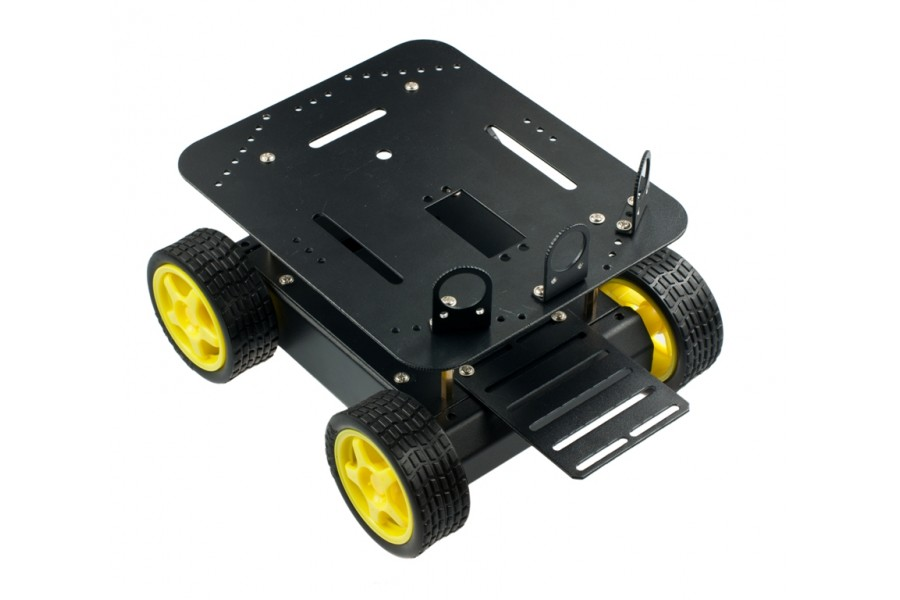

# Características

La estructura del rover Erle esta basado en [Pirate-four-wheel-drive Mobile Platform](http://www.dfrobot.com/index.php?route=product/product&path=37_111&product_id=97). El *Pirate-4WD robot* es un diseño original de  DFRobot y ampliamente usado como plataforma de desarrollo propio. La plataforma puede ser controlada por un amplia variedad de microcontroladores incluyendo nuestra **placa Erle**.

El Pirate-4WD tiene cuatro ruedas diferentes, impulsadas por motores de alta velocidad y alta calidad y ruedas de goma flexibles se montan en un cuerpo de aleación de aluminio de alta resistencia. Esta plataforma robótica es adecuada para uso en interiores o superficies planas.

Otras características notables son:

|**Característica**|**Valor**|
|-----|------|
|Peso completo|710g|
|Diámetro de la rueda | 65mm|
|Velocidad máxima| 61cm/s|
|**Carateríticas del motor**|**Valor**|
|Relación de engranajes | 1:120|
|Velocidad sin carga (3V)| 100RPM|
|Velocidad sin carga (6V)| 200RPM|
|Corriente sin carga (3V)|60mA|
|Corriente sin carga (6V)| 71mA|
|Corriente Stall (3V)| 260mA|
|Corriente Stall (6V)| 470mA|
|Par (3V)| 1.2Kgcm|
|Par (6V)| 1.92Kgcm|
|Peso | 45g|